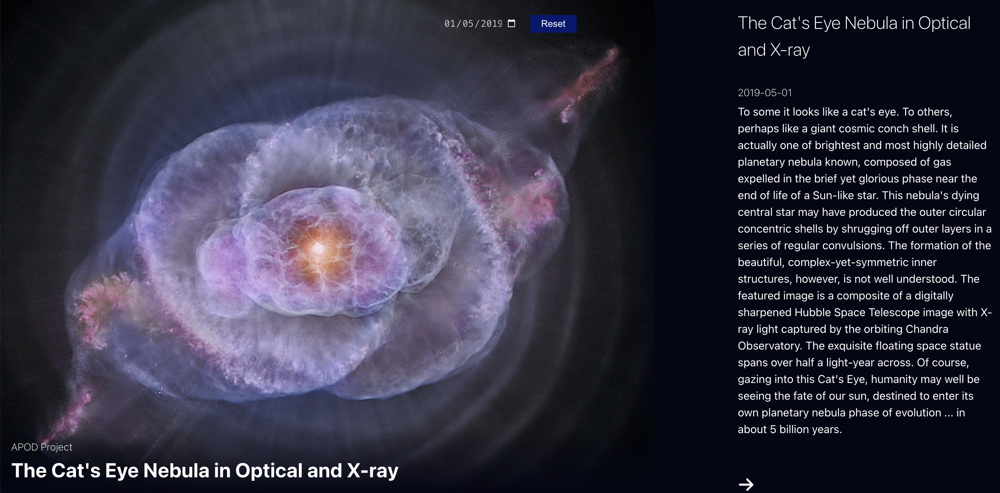

# NASA Astronomy Picture of the Day



This React.js application fetches and displays the Astronomy Picture of the Day (APOD) from NASA's API. Users can view the picture along with a descriptive text explaining the image. Additionally, users can select a date to see the corresponding Astronomy Picture of the Day for that date.

## Features

- **Fetch and Display APOD**: Automatically fetches and displays the Astronomy Picture of the Day.
- **Date Selection**: Allows users to select a date to view the APOD for that specific date.
- **Session Storage**: Caches the fetched data in session storage to reduce redundant API calls and improve performance.

## Installation

1. Clone the repository:

   ```bash
   git clone https://github.com/your-username/nasa-apod-react-app.git
   cd nasa-apod-react-app
   ```

2. Install dependencies:

   ```node
   npm install

   ```

3. Create a .env file in the root directory and add your NASA API key:
   `REACT_APP_NASA_API_KEY=your_nasa_api_key`

## Usage

1. Start the development server:

```node
npm start

```

2. Open your browser and navigate to
   `http://localhost:3000.`

## Components

### App Component

- Manages the state for the Astronomy Picture of the Day and the selected date.
- Fetches data from NASA's API based on the selected date.
- Stores fetched data in local storage.

### DateInput Component

- Renders a date input field.
- Allows users to select a date to fetch the corresponding APOD.

### APODDisplay Component

- Displays the fetched Astronomy Picture of the Day.
- Shows the title, image, and description of the APOD.

## API

- This application uses NASA's Astronomy Picture of the Day API. You can find more information about the API [here](https://api.nasa.gov/).
